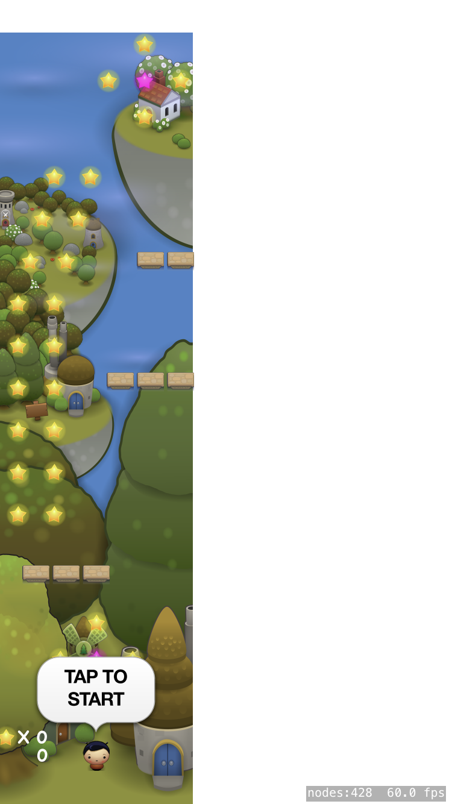

# UberJump
Followed Ray Wenderlich tutorial using SpriteKit, translated from Objective-C to Swift 

Tutorial by Toby Stephens
https://www.raywenderlich.com/2467-how-to-make-a-game-like-mega-jump-with-sprite-kit-part-1-2
https://www.raywenderlich.com/2467-how-to-make-a-game-like-mega-jump-with-sprite-kit-part-2-2

The tutorial was written in 2014 and has been moved to their archive but is still a good resource to learn how to make an iOS game with SpriteKit

Minor edits were made throughout. Many "magic numbers"/ non-dynamic elements were used that probably worked on older iPhones (i.e: screen co-ordinates/sizes). 

Tested on iPhone 6 and 7, first game does not fill the screen. Second game is not centred and is cut off.  

